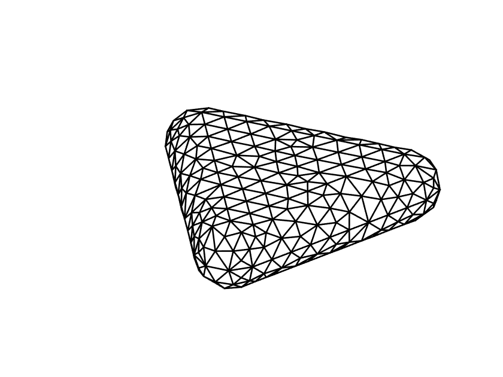

# Modelling of the optical properties of gold & silver nanoparticles with alternating morphologies using finite element method
The code is written in plain text, and is meant to be copy/pasted into the MATLAB editor. Only the '.m' files containing refractive indices have to be installed.
## Analytical model for spherical nanoparticles
  1. Ensure that files nrau.m, nrag.m, niau.m and niag.m are installed and visible in the MATLAB folder.
  2. Run the [absorption calculation code](https://github.com/Lasseb200/P3/blob/main/MATLAB%20Analytical%20model%20for%20spherical%20nanoparticles).
## Finite element method
### Pulse expansion:
  1. Ensure that files nrau.m, nrag.m, niau.m and niag.m are installed and visible in the MATLAB folder.
  2. Run the 3D point model for either [spheres](https://github.com/Lasseb200/P3/blob/main/MATLAB-finite-element-method/Pulse%20expansion/Sphere%20point%20model%20with%20normal%20vectors%20and%20area%20calculations), [rods](https://github.com/Lasseb200/P3/blob/main/MATLAB-finite-element-method/Pulse%20expansion/Rod%20point%20model%20with%20normal%20vectors%20and%20area%20calculations) or [prisms](https://github.com/Lasseb200/P3/blob/main/MATLAB-finite-element-method/Pulse%20expansion/Prism%20point%20model%20with%20normal%20vectors%20and%20area%20calculations).
  3. Run the [absorption calculation code](https://github.com/Lasseb200/P3/blob/main/MATLAB-finite-element-method/Pulse%20expansion/Calculation%20and%20plot%20of%20absorption%20cross%20section). Make sure that the variables from the 3D model haven't been cleared.
  
notes: Choose between gold or silver nanoparticles by choosing permitivitty on line 61 in the absorption calculation code, the direction of the E-field is chosen on line 58. The rod and prism models can be rotated in any direction in the bottom of their respective source code. 

#### Total absorption from different angles
The combined absorption from *N* different angles can be calculated for spheres(WIP) and [prisms](https://github.com/Lasseb200/P3/blob/main/MATLAB-finite-element-method/Pulse%20expansion/Prisms_total_absorption). The code is, however, quite processing heavy.

 
### Linear expansion (WIP)
  1. Ensure that files nrau.m, nrag.m, niau.m and niag.m are installed and visible in the MATLAB folder.
  2. Ensure that the MATLAB add-on '[Partial Differential Equation Toolbox](https://se.mathworks.com/products/pde.html)' is installed.
  3. Run the 3D mesh model for either [spheres](https://github.com/Lasseb200/P3/blob/main/MATLAB-finite-element-method/Linear%20expansion/(WIP)%20Sphere%20mesh), [rods](https://github.com/Lasseb200/P3/blob/main/MATLAB-finite-element-method/Linear%20expansion/(WIP)%20Rod%20mesh) or [prisms](https://github.com/Lasseb200/P3/blob/main/MATLAB-finite-element-method/Linear%20expansion/(WIP)%20Prism%20mesh).

